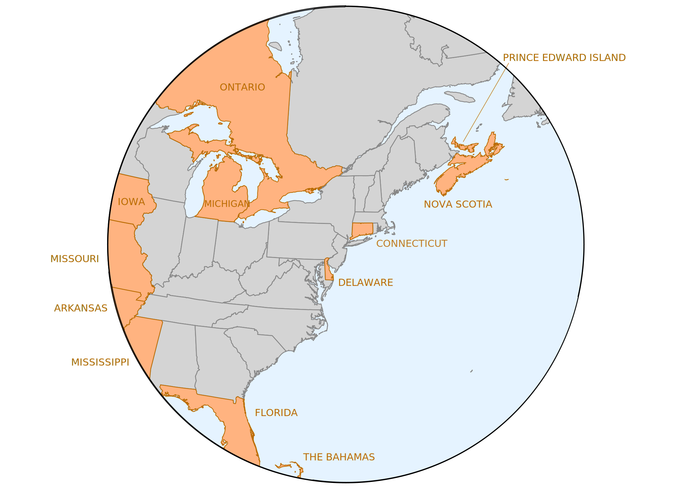
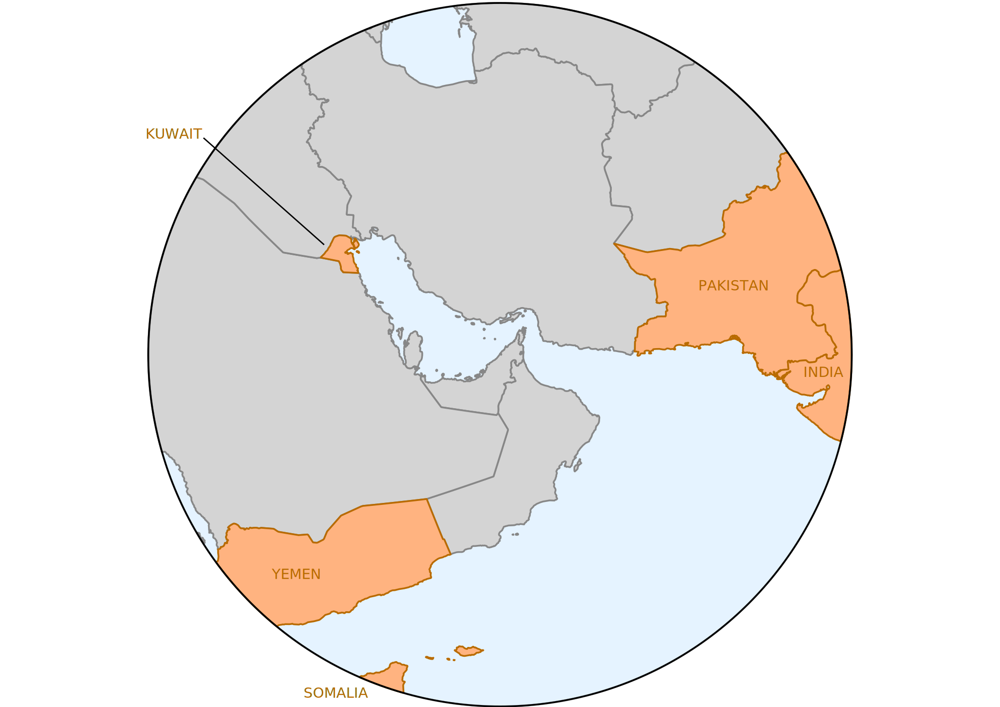

# Unschooling friendly countries

## Definition

Whithin the context of the following list, an _unschooling friendly country_ is a sovereign state
or a self-governing territory with permanent population not part of a sovereign state, in which:

1. Homeschooling is a legal form of schooling ;
2. It requires no prior authorisation ;
3. It can be curriculum-free.

## List of countries

|       | Countries                                                                         |
| ----- | :-------------------------------------------------------------------------------- |
| **✓** | [Abkhazia](Countries/Abkhazia.md)                                                 |
| **✗** | [Afghanistan](Countries/Afghanistan.md)                                           |
| **✗** | [Albania](Countries/Albania.md)                                                   |
| **✗** | [Algeria](Countries/Algeria.md)                                                   |
| **✗** | [American Samoa](Countries/American-Samoa.md)                                     |
| **✗** | [Andorra](Countries/Andorra.md)                                                   |
| **✗** | [Angola](Countries/Angola.md)                                                     |
| **✗** | [Anguilla](Countries/Anguilla.md)                                                 |
| **✗** | [Antigua and Barbuda](Countries/Antigua-and-Barbuda.md)                           |
| **✗** | [Argentina](Countries/Argentina.md)                                               |
| **✗** | [Armenia](Countries/Armenia.md)                                                   |
| **✗** | [Aruba](Countries/Aruba.md)                                                       |
| **✗** | [Australia](Countries/Australia/README.md)                                        |
| **✗** | [Austria](Countries/Austria.md)                                                   |
| **✗** | [Azerbaijan](Countries/Azerbaijan.md)                                             |
| **✓** | [Bahamas](Countries/Bahamas.md)                                                   |
| **✓** | [Bahrain](Countries/Bahrain.md)                                                   |
| **✗** | [Bangladesh](Countries/Bangladesh.md)                                             |
| **✗** | [Barbados](Countries/Barbados.md)                                                 |
| **✗** | [Belarus](Countries/Belarus.md)                                                   |
| **✗** | [Belgium](Countries/Belgium.md)                                                   |
| **✗** | [Belize](Countries/Belize.md)                                                     |
| **✓** | [Benin](Countries/Benin.md)                                                       |
| **✗** | [Bermuda](Countries/Bermuda.md)                                                   |
| **✓** | [Bhutan](Countries/Bhutan.md)                                                     |
| **✓** | [Bolivia](Countries/Bolivia.md)                                                   |
| **✗** | [Bosnia and Herzegovina](Countries/Bosnia-Herzegoniva.md)                         |
| **✓** | [Botswana](Countries/Botswana.md)                                                 |
| **✗** | [Brazil](Countries/Brazil.md)                                                     |
| **✗** | [British Virgin Islands](Countries/British-Virgin-Islands.md)                     |
| **✗** | [Brunei](Countries/Brunei.md)                                                     |
| **✗** | [Bulgaria](Countries/Bulgaria.md)                                                 |
| **✓** | [Burkina Faso](Countries/Burkina-Faso.md)                                         |
| **✓** | [Burundi](Countries/Burundi.md)                                                   |
| **✓** | [Cambodia](Countries/Cambodia.md)                                                 |
| **✗** | [Cameroon](Countries/Cameroon.md)                                                 |
| **~** | [Canada](Countries/Canada/README.md)                                              |
| **✗** | [Cape Verde](Countries/Cape-Verde.md)                                             |
| **✗** | [Cayman Islands](Countries/Cayman-Islands.md)                                     |
| **✗** | [Centrafrique](Countries/Centrafrique.md)                                         |
| **✗** | [Chad](Countries/Chad.md)                                                         |
| **✓** | [Chile](Countries/Chile.md)                                                       |
| **~** | [China](Countries/China/README.md)                                                |
| **✓** | [Colombia](Countries/Colombia.md)                                                 |
| **✗** | [Comoros](Countries/Comoros.md)                                                   |
| **✗** | [Congo-Brazzaville](Countries/Congo-Brazzaville.md)                               |
| **✗** | [Congo-Kinshasa](Countries/Congo-Kinshasa.md)                                     |
| **✗** | [Cook Islands](Countries/Cook-Islands.md)                                         |
| **✗** | [Costa Rica](Countries/Costa-Rica.md)                                             |
| **✗** | [Croatia](Countries/Croatia.md)                                                   |
| **✗** | [Cuba](Countries/Cuba.md)                                                         |
| **✗** | [Curaçao](Countries/Curaçao.md)                                                   |
| **✗** | [Cyprus](Countries/Cyprus.md)                                                     |
| **✗** | [Czech Republic](Countries/Czech-Republic.md)                                     |
| **✗** | [Denmark](Countries/Denmark/README.md)                                            |
| **✓** | [Djibouti](Countries/Djibouti.md)                                                 |
| **✗** | [Dominica](Countries/Dominica.md)                                                 |
| **✓** | [Dominican Republic](Countries/Dominican-Republic.md)                             |
| **✗** | [East Timor](Countries/East-Timor.md)                                             |
| **✗** | [Ecuador](Countries/Ecuador.md)                                                   |
| **✗** | [Egypt](Countries/Egypt.md)                                                       |
| **✓** | [El Salvador](Countries/El-Salvador.md)                                           |
| **✓** | [Equatorial Guinea](Countries/Equatorial-Guinea.md)                               |
| **✓** | [Eritrea](Countries/Eritrea.md)                                                   |
| **✗** | [Estonia](Countries/Estonia.md)                                                   |
| **✗** | [Eswatini](Countries/Eswatini.md)                                                 |
| **✓** | [Ethiopia](Countries/Ethiopia.md)                                                 |
| **✗** | [Falkland Islands](Countries/Falkland-Islands.md)                                 |
| **✗** | [Fidji](Countries/Fidji.md)                                                       |
| **✗** | [Finland](Countries/Finland/README.md)                                            |
| **~** | [France](Countries/France/README.md)                                              |
| **✓** | [Gabon](Countries/Gabon.md)                                                       |
| **✓** | [Gambia](Countries/Gambia.md)                                                     |
| **✓** | [Georgia](Countries/Georgia.md)                                                   |
| **✗** | [Germany](Countries/Germany.md)                                                   |
| **✗** | [Ghana](Countries/Ghana.md)                                                       |
| **✓** | [Gibraltar](Countries/Gibraltar.md)                                               |
| **✗** | [Greece](Countries/Greece.md)                                                     |
| **✗** | [Grenada](Countries/Grenada.md)                                                   |
| **✓** | [Guam](Countries/Guam.md)                                                         |
| **✗** | [Guatemala](Countries/Guatemala.md)                                               |
| **✗** | [Guernsey](Countries/Guernsey.md)                                                 |
| **✗** | [Guinea](Countries/Guinea.md)                                                     |
| **✗** | [Guinea-Bissau](Countries/Guinea-Bissau.md)                                       |
| **✓** | [Guyana](Countries/Guyana.md)                                                     |
| **✓** | [Haiti](Countries/Haiti.md)                                                       |
| **✗** | [Honduras](Countries/Honduras.md)                                                 |
| **✗** | [Hungary](Countries/Hungary.md)                                                   |
| **✗** | [Iceland](Countries/Iceland.md)                                                   |
| **✓** | [India](Countries/India.md)                                                       |
| **✓** | [Indonesia](Countries/Indonesia.md)                                               |
| **✗** | [Iran](Countries/Iran.md)                                                         |
| **✗** | [Iraq](Countries/Iraq.md)                                                         |
| **✗** | [Ireland](Countries/Ireland.md)                                                   |
| **✓** | [Isle of Man](Countries/Isle-of-Man.md)                                           |
| **✗** | [Israel](Countries/Israel.md)                                                     |
| **✗** | [Italy](Countries/Italy.md)                                                       |
| **✗** | [Ivory Coast](Countries/Ivory-Coast.md)                                           |
| **✓** | [Jamaica](Countries/Jamaica.md)                                                   |
| **✗** | [Japan](Countries/Japan.md)                                                       |
| **✗** | [Jersey](Countries/Jersey.md)                                                     |
| **✗** | [Jordan](Countries/Jordan.md)                                                     |
| **✗** | [Kazakhstan](Countries/Kazakhstan.md)                                             |
| **✗** | [Kenya](Countries/Kenya.md)                                                       |
| **✗** | [Kiribati](Countries/Kiribati.md)                                                 |
| **✗** | [Kosovo](Countries/Kosovo.md)                                                     |
| **✓** | [Kuwait](Countries/Kuwait.md)                                                     |
| **✗** | [Kyrgyzstan](Countries/Kyrgyzstan.md)                                             |
| **✗** | [Laos](Countries/Laos.md)                                                         |
| **✗** | [Latvia](Countries/Latvia.md)                                                     |
| **✗** | [Lebanon](Countries/Lebanon.md)                                                   |
| **✗** | [Lesotho](Countries/Lesotho.md)                                                   |
| **✗** | [Liberia](Countries/Liberia.md)                                                   |
| **✗** | [Libya](Countries/Libya.md)                                                       |
| **✗** | [Liechtenstein](Countries/Liechtenstein.md)                                       |
| **✗** | [Lithuania](Countries/Lithuania.md)                                               |
| **✗** | [Luxembourg](Countries/Luxembourg.md)                                             |
| **✓** | [Madagascar](Countries/Madagascar.md)                                             |
| **✗** | [Malawi](Countries/Malawi.md)                                                     |
| **✗** | [Malaysia](Countries/Malaysia.md)                                                 |
| **✗** | [Maldives](Countries/Maldives.md)                                                 |
| **✗** | [Mali](Countries/Mali.md)                                                         |
| **✗** | [Malta](Countries/Malta.md)                                                       |
| **✗** | [Marshall Islands](Countries/Marshall-Islands.md)                                 |
| **✓** | [Mauritania](Countries/Mauritania.md)                                             |
| **✗** | [Mauritius](Countries/Mauritius.md)                                               |
| **✓** | [Mexico](Countries/Mexico.md)                                                     |
| **✗** | [Micronesia](Countries/Micronesia.md)                                             |
| **✗** | [Moldova](Countries/Moldova.md)                                                   |
| **✓** | [Monaco](Countries/Monaco.md)                                                     |
| **✓** | [Mongolia](Countries/Mongolia.md)                                                 |
| **✗** | [Montenegro](Countries/Montenegro.md)                                             |
| **✗** | [Montserrat](Countries/Montserrat.md)                                             |
| **✗** | [Morocco](Countries/Morocco.md)                                                   |
| **✗** | [Mozambique](Countries/Mozambique.md)                                             |
| **✗** | [Myanmar](Countries/Myanmar.md)                                                   |
| **✗** | [Namibia](Countries/Namibia.md)                                                   |
| **✗** | [Nauru](Countries/Nauru.md)                                                       |
| **✗** | [Nepal](Countries/Nepal.md)                                                       |
| **✗** | [Netherlands](Countries/Netherlands.md)                                           |
| **✗** | [New Zealand](Countries/New-Zealand.md)                                           |
| **✓** | [Nicaragua](Countries/Nicaragua.md)                                               |
| **✗** | [Niger](Countries/Niger.md)                                                       |
| **✗** | [Nigeria](Countries/Nigeria.md)                                                   |
| **✗** | [Niue](Countries/Niue.md)                                                         |
| **✗** | [North Korea](Countries/North-Korea.md)                                           |
| **✗** | [Northern Macedonia](Countries/Northern-Macedonia.md)                             |
| **✗** | [Northern Mariana Islands](Countries/Northern-Mariana-Islands.md)                 |
| **✗** | [Northern Cyprus](Countries/Northern-Cyprus.md)                                   |
| **✗** | [Norway](Countries/Norway.md)                                                     |
| **✗** | [Oman](Countries/Oman.md)                                                         |
| **✓** | [Pakistan](Countries/Pakistan.md)                                                 |
| **✗** | [Palau](Countries/Palau.md)                                                       |
| **✗** | [Palestine](Countries/Palestine.md)                                               |
| **✗** | [Panama](Countries/Panama.md)                                                     |
| **✓** | [Papua New Guinea](Countries/Papua-New-Guinea.md)                                 |
| **✗** | [Paraguay](Countries/Paraguay.md)                                                 |
| **✓** | [Peru](Countries/Peru.md)                                                         |
| **✓** | [Philippines](Countries/Philippines.md)                                           |
| **✗** | [Pitcairn, Henderson, Ducie and Oeno Islands](Countries/Pitcairn-Islands.md)      |
| **✗** | [Poland](Countries/Poland.md)                                                     |
| **✗** | [Portugal](Countries/Portugal.md)                                                 |
| **✗** | [Puerto Rico](Countries/Puerto-Rico.md)                                           |
| **✗** | [Qatar](Countries/Qatar.md)                                                       |
| **✗** | [Romania](Countries/Romania.md)                                                   |
| **✗** | [Russia](Countries/Russia.md)                                                     |
| **✓** | [Rwanda](Countries/Rwanda.md)                                                     |
| **✓** | [Sahrawi ADR](Countries/SADR.md)                                                  |
| **✓** | [Saint Helena, Ascension and Tristan da Cunha](Countries/Saint-Helena.md)         |
| **✗** | [Saint Kitts and Nevis](Countries/Saint-Kitts-and-Nevis.md)                       |
| **✗** | [Saint Lucia](Countries/Saint-Lucia.md)                                           |
| **✗** | [Saint Vincent and the Grenadines](Countries/Saint-Vincent-and-the-Grenadines.md) |
| **✗** | [Samoa](Countries/Samoa.md)                                                       |
| **✗** | [San Marino](Countries/San-Marino.md)                                             |
| **✗** | [São Tomé and Príncipe](Countries/São-Tomé-and-Príncipe.md)                       |
| **✗** | [Saudi Arabia](Countries/Saudi-Arabia.md)                                         |
| **✗** | [Senegal](Countries/Senegal.md)                                                   |
| **✗** | [Serbia](Countries/Serbia.md)                                                     |
| **✗** | [Seychelles](Countries/Seychelles.md)                                             |
| **✓** | [Sierra Leone](Countries/Sierra-Leone.md)                                         |
| **✗** | [Singapore](Countries/Singapore.md)                                               |
| **✗** | [Sint Maarten](Countries/Sint-Maarten.md)                                         |
| **✗** | [Slovakia](Countries/Slovakia.md)                                                 |
| **✗** | [Slovenia](Countries/Slovenia.md)                                                 |
| **✗** | [Solomon Islands](Countries/Solomon-Islands.md)                                   |
| **✓** | [Somalia](Countries/Somalia.md)                                                   |
| **✓** | [Somaliland](Countries/Somaliland.md)                                             |
| **✗** | [South Africa](Countries/South-Africa.md)                                         |
| **✗** | [South Korea](Countries/South-Korea.md)                                           |
| **✓** | [South Ossetia](Countries/South-Ossetia.md)                                       |
| **✗** | [South Sudan](Countries/South-Sudan.md)                                           |
| **✗** | [Sovereign Base Areas of Akrotiri and Dhekelia](Countries/SBAs.md)                |
| **✗** | [Spain](Countries/Spain.md)                                                       |
| **✓** | [Sri Lanka](Countries/Sri-Lanka.md)                                               |
| **✗** | [Sudan](Countries/Sudan.md)                                                       |
| **✗** | [Suriname](Countries/Suriname.md)                                                 |
| **✗** | [Sweden](Countries/Sweden.md)                                                     |
| **✗** | [Switzerland](Countries/Switzerland/README.md)                                    |
| **✗** | [Syria](Countries/Syria.md)                                                       |
| **✗** | [Taiwan](Countries/Taiwan.md)                                                     |
| **✗** | [Tajikistan](Countries/Tajikistan.md)                                             |
| **✗** | [Tanzania](Countries/Tanzania.md)                                                 |
| **✗** | [Thailand](Countries/Thailand.md)                                                 |
| **✗** | [Togo](Countries/Togo.md)                                                         |
| **✗** | [Tonga](Countries/Tonga.md)                                                       |
| **✗** | [Transnistria](Countries/Transnistria.md)                                         |
| **✓** | [Trinidad and Tobago](Countries/Trinidad-and-Tobago.md)                           |
| **✗** | [Tunisia](Countries/Tunisia.md)                                                   |
| **✗** | [Turkey](Countries/Turkey.md)                                                     |
| **✗** | [Turkmenistan](Countries/Turkmenistan.md)                                         |
| **✗** | [Turks and Caicos Islands](Countries/Turks-and-Caicos-Islands.md)                 |
| **✓** | [Tuvalu](Countries/Tuvalu.md)                                                     |
| **✓** | [Uganda](Countries/Uganda.md)                                                     |
| **✗** | [Ukraine](Countries/Ukraine.md)                                                   |
| **✗** | [United Arab Emirates](Countries/UAE.md)                                          |
| **~** | [United Kingdom](<Countries/United Kingdom/README.md>)                            |
| **~** | [United States](Countries/United-States/README.md)                                |
| **✗** | [U. S. Virgin Islands](Countries/US-Virgin-Islands.md)                            |
| **✗** | [Uruguay](Countries/Uruguay.md)                                                   |
| **✗** | [Uzbekistan](Countries/Uzbekistan.md)                                             |
| **✓** | [Vanuatu](Countries/Vanuatu.md)                                                   |
| **✓** | [Vatican City](Countries/Vatican-City.md)                                         |
| **~** | [Venezuela](Countries/Venezuela.md)                                               |
| **✓** | [Vietnam](Countries/Vietnam.md)                                                   |
| **✓** | [Yemen](Countries/Yemen.md)                                                       |
| **✗** | [Zambia](Countries/Zambia.md)                                                     |
| **✗** | [Zimbabwe](Countries/Zimbabwe.md)                                                 |

## Maps

|                               Map of unschooling friendly countries                                | near          |
| :------------------------------------------------------------------------------------------------: | :------------ |
|  | London        |
|                 | New York City |
|                      | Hong Kong     |
|               | Singapore     |
|                       | Tokyo         |
|                       | Dubai         |

 ## Global developments in compulsory early childhood education (2022–2025)

Since 2022, a growing number of countries have introduced or expanded laws
making preschool education compulsory for children between the ages of 3 and 5.
This trend is closely linked to international policy initiatives and
coordination mechanisms.

A major turning point was the UNESCO World Conference on Early Childhood Care
and Education, held in Tashkent in November 2022.
During this event, 147 countries endorsed the Tashkent Declaration, which called
for all governments to provide at least one year of free and compulsory pre-
primary education.
This commitment aligns with Sustainable Development Goal 4.2, which aims for
universal access to quality early childhood education by 2030.

These reforms are often reinforced by external incentives.
In the European Union, for instance, funding from the Recovery and Resilience
Facility is conditional on implementing early childhood education targets.
In other regions, World Bank and Global Partnership for Education grants support
similar reforms.

Additionally, international organizations such as the OECD and UNESCO have begun
publishing detailed comparisons of early childhood systems, including legal
obligations and enrollment rates.
This reporting contributes to a form of peer pressure, encouraging countries to
align with emerging international norms.
